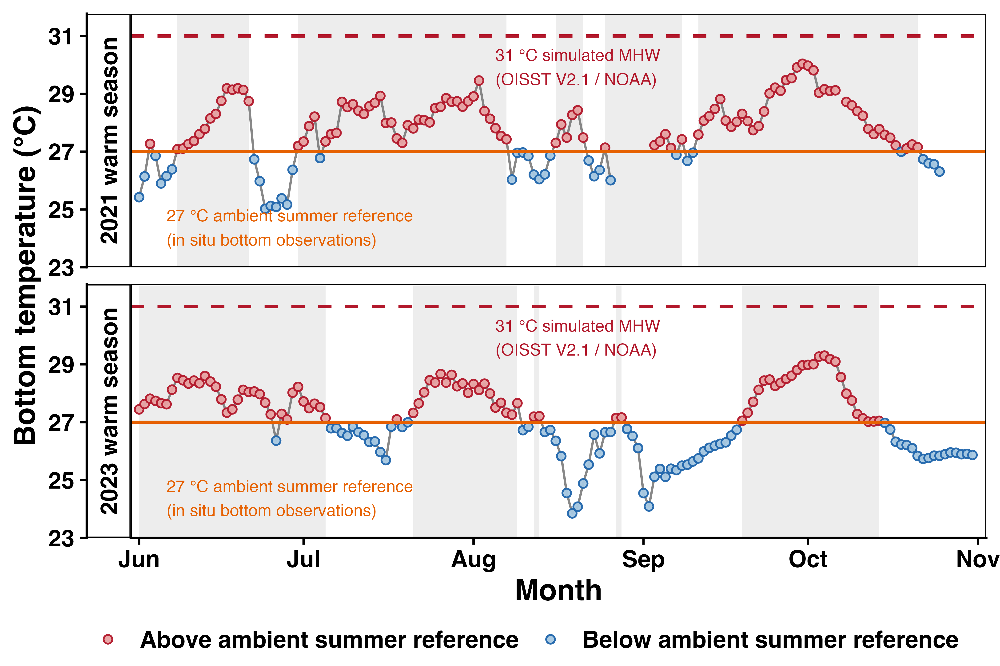

# Supplementary Thermal Context Analysis

## Overview

This repository contains the code, source data, and outputs used to generate **Supplementary Figure S1** and **Supplementary Table S1** accompanying a manuscript currently under peer review.

The repository is intentionally anonymized for review purposes.

This workflow reconstructs **warm-season bottom-temperature dynamics from field observations** and uses these observations to establish an ecologically grounded thermal framework for experimental temperature selection.

Specifically, the analysis addresses three questions:

1. What temperatures naturally occur at the study site during the warm season?
2. Is the selected ambient experimental temperature environmentally realistic?
3. Does the simulated marine heatwave scenario reflect natural thermal conditions?

---

## Supplementary outputs

### Supplementary Figure S1  
Warm-season bottom-temperature dynamics reconstructed from field observations.



The figure illustrates:

- observed daily bottom temperatures during warm seasons
- the selected ambient experimental temperature (**27 °C**)
- the simulated marine heatwave treatment (**31 °C**)
- temporal clustering of warm periods
- natural recovery intervals between warm events

Grey shading indicates detected warm periods based on consecutive days above the ambient reference threshold.

---

### Supplementary Table S1  
Summary statistics of warm-season thermal conditions.

| Year | Mean (°C) | Max (°C) | Warm days ≥27 °C | Warm periods | Longest (d) | Mean length (d) |
|------|------:|------:|------:|------:|------:|------:|
| 2021 | 27.7 | 30.0 | 104 | 5 | 41 | 23 |
| 2023 | 27.1 | 29.3 | 85 | 5 | 35 | 17 |

These metrics summarize the temporal structure of natural warming and provide environmental context for selecting experimental thermal profiles.

---

## Data source

Field temperature observations were obtained from the **Cape D’Aguilar monitoring station** through the Aqualink platform.

Source:  
https://aqualink.org/sites/2975

Original downloaded file:

`data_site_2975_2021_05_20_2026_03_30.csv`

Data processing uses daily mean bottom-temperature observations to quantify warm-season thermal structure and derive environmentally relevant experimental conditions.

---

## Project concept

Experimental thermal studies often simplify environmental stress into fixed temperature treatments.

This workflow instead begins from **observed environmental conditions** and reconstructs thermal structure before experimental implementation.

Analysis pipeline:

```text
Field observations
      ↓
Daily bottom temperatures
      ↓
Warm-period detection
      ↓
Thermal summary metrics
      ↓
Experimental temperature selection
```

Outputs provide environmental justification for:

- ambient baseline temperature
- simulated heatwave temperature
- warming duration
- recovery structure

---

## Repository contents

```text
.
├── FigS1_n_TableS1.R
├── Fig_S1_field_bottom_temperature_aligned.png
├── Table_S1_field_temperature_summary.csv
├── data_site_2975_2021_05_20_2026_03_30.csv
├── README.md
```

---

## R workflow

### 1. Import and clean observations

Prepare bottom-temperature observations.

Main steps:

- import raw field records
- convert timestamps
- remove missing observations
- retain warm-season data

Output:

clean daily temperature series

---

### 2. Calculate daily thermal structure

Convert observations into ecological descriptors.

Calculations:

- daily mean temperature
- daily maximum temperature
- warm-day classification

Definition:

Warm day = daily mean ≥ ambient threshold

Output:

daily thermal time series

---

### 3. Detect warm periods

Describe temporal thermal structure.

Rules:

- minimum warm-event duration = 2 days
- short cool interruptions are merged
- event durations are summarized

Output:

- warm-period count
- longest event
- average event duration

---

### 4. Generate Supplementary Figure S1

Visualize environmental thermal context.

Figure components:

- observed temperature trajectory
- ambient reference line
- simulated heatwave line
- warm-period shading
- threshold classification

Output:

publication-ready figure

---

### 5. Generate Supplementary Table S1

Summarize warm-season temperature conditions.

Metrics:

- mean temperature
- maximum temperature
- warm days
- warm periods
- longest duration
- average duration

Output:

supplementary summary table

---

## Software

Tested using:

- R (≥ 4.4)
- tidyverse
- lubridate

---

## Notes

This repository contains supplementary analysis code and environmental context outputs only.

No identifying author information, manuscript metadata, or review-sensitive materials are included.
